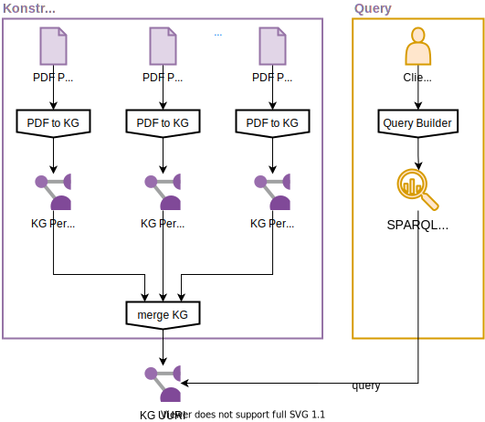

# AUTOMASI PEMBUATAN KNOWLEDGE GRAPH UNTUK PERATURAN PERUNDANG-UNDANGAN DI INDONESIA

# BAB 1 PENDAHULUAN

## Latar Belakang

Peraturan   perundang-undangan   adalah   peraturan tertulis  yang  memuat norma
hukum  yang  mengikat secara  umum  dan  dibentuk  atau  ditetapkan  oleh
lembaga negara atau pejabat yang berwenang melalui prosedur yang ditetapkan
dalam peraturan perundang-undangan, sesuai yang dijelaskan dalam UU Nomor 12
Tahun 2011 Pasal 1 Ayat 2 [1]. Peraturan perundang-undangan dapat digunakan
untuk menjawab pertanyaan yang berkaitan dengan hukum, seperti:

- Peraturan apa saja yang berlaku pada suatu daerah?
- Apa hubungan suatu peraturan dengan peraturan lain?
- Apa saja peraturan yang mengatur suatu topik?

Pertanyaan-pertanyaan tersebut umumnya dapat dijawab oleh seorang ahli hukum,
artinya penerapan peraturan perundang-undangan ini hanya dapat dilakukan dalam
skala kecil dan biaya relatif mahal. Komputer dapat menjadi alternatif untuk
aplikasi tersebut dalam skala lebih besar dan biaya lebih murah, jika peraturan
perundang-undangan berupa data terstruktur yang dapat diolah oleh komputer.
Sayangnya, data peraturan perundang-undangan umumnya dibuat dalam bentuk data
semi-terstruktur, yaitu berupa dokumen yang memiliki data terstruktur seperti
aturan penomoran dan aturan struktur (seperti bab, pasal, dan ayat), tetapi
penulisan peraturan sendiri dalam bentuk data tidak terstruktur yaitu teks
bahasa manusia.


Gambar diatas merupakan salah satu contoh ekstraksi informasi dari UU No.11
Tahun 2020 tentang Ketenagakerjaan. Pada gambar diatas, dapat dilihat bahwa
sebagian informasi dapat diekstraksi dari sifat terstruktur dokumen peraturan
perundang-undangan (ditandai dengan warna merah), dan sebagian informasi lainnya
dapat diekstraksi dari data tidak terstruktur beruba teks (ditandai dengan warna
biru). Untuk melakukan ekstraksi informasi tidak terstruktur seperti pada gambar
yaitu "UU No.11 Tahun 2020 Pasal 6 menyebut UU No.11 Tahun 2020 Pasal 5 ayat(1)
huruf a", manusia pertama-tama perlu membaca dari awal kalimat sampai menemukan
pola _string_ yang merujuk kepada suatu komponen dokumen peraturan
perundang-undangan, kemudian meng-_infer_ informasi lengkap dari komponen
tersebut. Proses konversi _string_ "Pasal 5 ayat (1) huruf a" menjadi informasi
lengkap "UU No.11 Tahun 2020 Pasal 5 ayat (1) huruf a" perlu dilakukan secara
manual oleh manusia.

Dengan melakukan ekstraksi data dari data tidak terstruktur pada dokumen,
digabung dengan data yang sudah terstruktur, peraturan perundang-undangan dapat
diubah menjadi dapat diolah oleh komputer. Selain dapat menjawab pertanyaan,
representasi _knowledge graph_ juga dapat digunakan untuk analisis karena data
sudah terstruktur. Representasi _knowledge graph_ juga memungkinkan untuk dapat
melakukan _reasoning_. Pada skripsi ini, akan dilakukan konversi dokumen
peraturan perundang-undangan menjadi data terstruktur dalam bentuk _knowledge
graph_, dan memberikan contoh pengaplikasian dari _knowledge graph_ peraturan
perundang-undangan tersebut.



Beberapa usaha telah dilakukan untuk membuat _vocabulary_ untuk _knowledge
graph_ peraturan perundang-undangan seperti _European Legislation Identifier_
(ELI) [2]. Tetapi ELI belum memiliki _vocabulary_ untuk struktur dokumen.
Sehingga dengan membuat _vocabulary_ yang belum tersedia, diharapkan dapat
menjadi kontribusi dalam mendukung pembuatan _knowledge graph_ untuk dokumen
peraturan perundan-undangan.

## Permasalahan

Berikut ini adalah rumusan permasalahan dari penelitian yang dilakukan:

- Bagaimana cara membuat _legal ontology_ untuk memperjelas _requirement_ dan
  mempermudah konversi dokumen PDF menjadi _knowledge graph_?
- Bagaimana konversi dokumen peraturan perudang-undangan menjadi _knowledge
  graph_ dapat dilakukan secara otomatis?
- Apa saja contoh aplikasi dari knowledge graph peraturan perundang-undangan
  tersebut?

// TODO: bagaimana melakukan proof of concept untuk yang udah dibuat, detail
untuk maintain, general large scale, evaluasi konversi

## Batasan Permasalahan

// TODO: fokus yang mainteined (UU + non UU), dan coba parsing UU hasil scraping

## Sistematika Penulisan

# BAB 2 TINJAUAN PUSTAKA

## Knowledge Graph

_Knowledge graph_ merupakan model data berbasis _graph_ yang menggambarkan
entitas dunia nyata dan hubungan antara entitas-entitas tersebut [5]. Sebagai
contoh, pada gambar dibawah dapat dilihat terpadat entitas-entitas yang ditandai
dengan bentuk lingkaran, dan hubungan antara entitas-entitas ditandai dengan
bentuk anak panah. Dapat dilihat pada gambar dibawah bahwa terdapat entitas
"James" dan "Louvre" dan properti "has visited" yang mengarah dari "James" ke
"Louvre". Relasi tersebut dapat kita anggap sebagai sebuah pengetahuan yang
dalam bahasa manusia dapat dituliskan sebagai "James pernah mengunjungi Louvre".
Model data seperti ini cocok untuk menyimpan data dengan banyak jenis relasi
antara entitas seperti pengetahuan umum, dibandingkan dengan _relational
database_ yang cocok untuk menyimpan data dengan relasi antar entitas yang sudah
diketahui dan terbatas.


_source_:<https://yashuseth.files.wordpress.com/2019/10/knowledge-graph.jpg>

## Resource Description Framework

Resource Description Framework (RDF) merupkan model data yang memberikan
pernyataan tentang suatu _resource_ dalam bentuk subjek-properti-objek, atau
sering disebut _triple_. Sebuah _knowledge graph_ dapat direpresentasikan
sebagai kumpulan _triple_. Subyek dan properti dalam _triple_ direpresentasikan
sebagai Uniform Resource Identifier (URI), sedangkan objek dapat
direpresentasikan dengan URI atau _string literal_. Pada gambar dibawah, dapat
dilihat terdapat _knowledge graph_ dengan dua _triple_. Pada triple 1 subjek,
properti, dan objek berturut-turut adalah
`https://example.org/james`,`https://example.org/has_visited`,`https://example.org/louvre`
yang mana semuanya berbentuk URI. Sedangkan pada triple 2 subjek, properti, dan
objek berturut-turut adalah
`https://example.org/james`,`https://example.org/has_name`, "james" .
`https://example.org/james`, `https://example.org/louvre` berturut-turut
merupakan notasi untuk _resource_ entitas James dan Louvre,
`https://example.org/has_visited` dan `https://example.org/has_name` merupakan
properti yang menjelaskan hubungan antara subjek dan objek, dan "james" adalah
_string literal_ yang menunjukan nilai dari nama James.


Terdapat beberapa format berkas dan sintaks untuk mengekspresikan RDF. Pada
penelitian ini, penulis menggunakan format Terse RDF Triple Language (Turtle).
Sebagai contoh, _knowledge graph_ diatas dapat dituliskan dalam format Turtle
sebagai berikut.

```ttl
<https://example.org/james> <https://example.org/has_visited> <https://example.org/louvre> .
<https://example.org/james> <https://example.org/has_name> "james" .
```

Dengan fitur format Turtle, dua _triple_ diatas dapat ditulis lebih singkat
dengan mengganti prefix URI yang sama menjadi teks yang lebih singkat, dan
menggabungkan penulisan beberapa _triple_ dengan subjek yang sama sehingga
subjek hanya perlu dituliskan sekali saja. Sebagai contoh, karena sebagaian
besar URI memiliki prefix `https://example.org/`, kita dapat menggantinya dengan
_string_ `ex` dengan mendeklarasikan `@prefix ex: <https://example.org/> .`.
Kedua _triple_ juga memiliki subjek yang sama yaitu `https://example.org/james`,
oleh karena itu, penulisan kedua turtle bisa digabung dengan hanya menuliskan
subjek sebanyak satu kali, kemudian menuliskan properti dan objek dipisah dengan
tanda titik koma . Berikut adalah contoh penulisan dua _triple_ diatas dalam
bentuk yang lebih singkat dan lebih mudah dibaca oleh manusia.

```ttl
@prefix ex: <https://example.org/> .

ex:james 
  ex:has_visited ex:louvre ;
  ex:has_name "james" .
```

## SPARQL

SPARQL merupakan salahsatu RDF _query language_ yaitu bahasa yang mampu
mengambil atau mengubah data yang disimpan dalam format RDF. Sintaks SPARQL
memiliki beberapa kesamaan dengan SQL, contohnya sebuah variabel diawali dengan
tanda tanya seperti `?name`. Berikut adalah penjelasan sintaks SPARQL.

- `PREFIX`: Mendeklarasikan pemetaan prefix URI menjadi _string_ yang lebih
  singkat. Hal ini dilakukan agar _query_ lebih mudah dibaca oleh manusia
  seperti sintaks `@prefix` pada Turtle.
- `SELECT`: Menyatakan variabel yang akan ditampilkan sebagai output dari
  _query_.
- `WHERE`: Menyatakan kondisi _triple_ yang akan ditampilkan pada output.

Berikut adalah contoh-contoh _query_ SPARQL yang dilakukan pada contoh
_knowledge graph_ pada subbab sebelumnya.

### Contoh Query 1

_Query_ ini bertujuan untuk menampilkan semua _triple_ yang terdapat pada
_knowledge graph_.

```sparql
PREFIX ex: <https://example.org/>
SELECT ?s 
       ?p
       ?o
WHERE
  {
    ?s ?p ?o
  }
```

Output dari _query_ tersebut adalah sebagai berikut.

| ?s       | ?p             | ?o        |
|----------|----------------|-----------|
| ex:james | ex:has_visited | ex:louvre |
| ex:james | ex:has_name    | "james"   |

### Contoh Query 2

_Query_ ini bertujuan untuk menampilkan semua properti dan objek pada _triple_
dengan subjek `https://example.org/james`.

```sparql
PREFIX ex: <https://example.org/>
SELECT ?p
       ?o
WHERE
  {
    ex:james ?p ?o
  }
```

Output dari _query_ tersebut adalah sebagai berikut.

| ?p             | ?o        |
|----------------|-----------|
| ex:has_visited | ex:louvre |
| ex:has_name    | "james"   |

### Contoh Query 3

_Query_ ini bertujuan untuk menampilkan semua objek pada _triple_ dengan subjek
`https://example.org/james` dan properti `https://example.org/has_visited`.
Artinya, _query_ ini menampilkan semua tempat yang pernah dikunjungi james.

```sparql
PREFIX ex: <https://example.org/>
SELECT ?visited_place
WHERE
  {
    ex:james ex:has_visited ?visited_place
  }
```

Output dari _query_ tersebut adalah sebagai berikut.

| ?visited_place |
|----------------|
| ex:louvre      |

## Peraturan Perundang-undangan

??? boleh ngequote sebanyak apa?

Menurut Undang-Undang Nomor 10 Tahun 2004 Pasal 7 Ayat 1, peraturan
perundang-undangan adalah peraturan tertulis yang dibentuk oleh lembaga negara
atau pejabat yang berwenang dan mengikat secara umum. Jenis dan hierarki
peraturan perundang-undangan terdiri atas:

- Undang-Undang Dasar Negara Republik Indonesia Tahun 1945
- Undang-Undang/Peraturan Pemerintah Pengganti Undang-Undang
- Peraturan Pemerintah
- Peraturan Presiden
- Peraturan Daerah

Berikut adalah beberapa peranan perundang-undangan untuk Indonesia [1]:

- Peraturan perundang-undangan merupakan kaidah hukum yang mudah dikenal
  (diidentifikasi), mudah diketemukan kembali, dan mudah ditelusuri. Sebagai
  kaidah hukum tertulis, bentuk, jenis,dan tempatnya jelas. Begitu pula
  pembuatnya.
- Peraturan perundang-undangan memberikan kepastian hukum yang lebih nyata
  karena kaidah-kaidahnya mudah diidentifikasi dan mudah diketemukan kembali.
- Struktur dan sistematika peraturan perundang-undangan lebih jelas sehingga
  memungkinkan untuk diperiksa kembali dan diuji baik segi-segi formal maupun
  materi muatannya.
- Pembentukan dan pengembangan peraturan perundang-undangan dapat direncanakan.
  Faktor ini sangat penting bagi negara-negara yang sedang membangun termasuk
  membangun sistem hukum baru yang sesuai dengan kebutuhan dan perkembangan
  masyarakat.

Menurut lampiran Undang-Undang Nomor 10 Tahun 2004, struktur peraturan
perundang–undangan terdiri atas:

- Judul
- Pembukaan
- Batang Tubuh
- Penutup
- Penjelasan (jika diperlukan)
- Lampiran (jika diperlukan)

Bagian judul, pembukaan, dan penutup memuat metadata dari peraturan
perundang-undangan tersebut seperti jenis, nomor, tahun pengundangan atau
penetapan, nama, jabatan pembentuk, konsiderans, kasar Hukum, peraturan
perundang-undangan. Konsiderans memuat uraian singkat mengenai pokok–pokok
pikiran yang menjadi latar belakang dan alasan pembuatan peraturan
perundang–undangan. Dasar Hukum memuat dasar kewenangan pembuatan peraturan
perundang-undangan dan peraturan perundang–undangan yang memerintahkan pembuatan
peraturan perundang–undangan tersebut. Oleh karena itu, kita dapat melihat
keterkaitan antara peraturan perundang-undangan dengan melihat konsiderans dan
dasar hukum dari peraturan tersebut.

Batang tubuh peraturan perundang-undangan memuat semua substansi peraturan
perundang-undangan yang dirumuskan dalam pasal. Pengelompokkan materi peraturan
perundang-undangan dapat disusun secara sistematis dalam buku, bab, bagian, dan
paragraf atas dasar kesamaan materi. Pasal dapat dirinci ke dalam beberapa ayat.
Pasal dan ayat dapat dibuat dalam bentuk kalimat maupun tabulasi rincian. Dalam
bentuk tabulasi rincian, setiap rincian harus dapat dibaca sebagai satu
rangkaian kesatuan dengan frase pembuka dan setiap rincian diawali dengan huruf
(abjad) kecil dan diberi tanda baca titik. Suatu rincian dapat dibagi lagi ke
unsur rincian yang lebih kecil.

Saat ini pembuatan dan pemanfaatan peraturan perundang-undangan masih dilakukan
secara manual oleh manusia. Pembuatan peraturan perundang-undangan dilakukan
dengan mengetikkan konten peraturan tersebut dengan format yang telah
ditentukan. Metode pembuatan tersebut tidak masalah jika hanya akan dibaca oleh
manusia karena manusia secara tidak sadar dapat melihat hirarki visual dari
dokumen tersebut dan membuat data yang dilihatnya terstruktur di dalam otak.
Metode ini membuat pemanfaatan peraturan perundang-undangan oleh mesin menjadi
kurang efisien karena mesin perlu melakukan proses tambahan yaitu mengkonversi
gambar menjadi data terstruktur.

## Pemodelan European Legislation Identifier (ELI)

ELI merupakan sistem untuk membuat peraturan perundang-undangan tersedia secara
daring dalam format terstandardisasi, sehingga dapat diakses dan digunakan oleh
berbagai instansi. ELI bertujuan untuk untuk memfasilitasi akses, berbagi dan
interkoneksi informasi hukum yang diterbitkan melalui nasional, Eropa dan sistem
informasi hukum global [6]. ELI dibangun berdasarkan persetujuan antara
negara-negara EU. Spesifikasi yang terdapat pada ELI antara lain:

- URI untuk informasi peraturan perundang-undangan.
- Metadata yang mendeskripsikan informasi peraturan perundang-undangan.

// TODO: terlalu singkat, ksh konsepnya gmn dan contoh pemodelan ELI utk suatu
  peraturan

// TODO: ELI jg msh simpel. Bs dijelaskan motivasi ELI, serta apa contoh konsep2
yg sdh ada di ELI ontology, serta yg belum ada.

// TODO: - ELI kekurangan lainnya ya lbh condong ke pemodelan peraturan di
Eropa, bukan di Indonesia. Misal, gak ada namanya Peraturan Pemerintah, atau
Pergub di ELI :)

# BAB 3 METODOLOGI

// TODO: Maintained docs masukin sini

// TODO: Utk yg metodologi, sbnrnya standar aja, dimulai dari pertanyaan riset,
lalu pengembangan ontology (URI scheming masuk ke pengembagan ontology),
pengembangan sistem konversi, baru lalu use case evaluation (ini yg legal KG
advanced querying, legal KG chatbot, legal KG visualization) baru large scale
eval (ini yg coba konversi peraturan dlm jumlah besar dan kita sampling utk
evaluasi correctnessnya)

TODO: suatu KG construction dimulai dengan competency questions (requirements).
Saran sy: coba baca serta rangkum (di Bab 2) dan terapkan ini:
www.ksl.stanford.edu/people/dlm/papers/ontology-tutorial-noy-mcguinness-abstract.html
???

# BAB 4 RANCANGAN

## Perancangan URI

Setiap entitas yang berbeda perlu diberikan URI yang berbeda. Penggabungan KG
sangat umum dilakukan karena secara struktur dapat dilakukan dengan mudah, dan
dapat memperkuat data dari masing-masing KG. KG memiliki entitas-entitas dengan
URI yang unik, oleh karena itu saat menggabungkan sebuah KG A dan sebuah KG B,
entitas yang berbeda harus memiliki URI yang berbeda. Sebuah masalah dapat
terjadi apabila URI tidak dirancang dengan benar. Sebagai contoh, apabila
terdapat entitas dari KG A dengan URI `https://example.org/trump` dengan maksud
Donald Trump mantan presiden Amerika Serikat, dan entitas dari KG B dengan URI
yang sama dengan maksud permainan kartu Trump, saat kedua KG ini digabung akan
menjadi informasi yang berkontradiksi.

Pada penelitian ini, semua URI menggunakan prefix `https://example.org/lex2kg/`
yang selanjutnya akan disebut _basePrefix_. Prefix ini dapat diganti dalam
program agar dapat disesuaikan oleh pengguna program. Semua entitas dokumen dan
komponennya menggunakan prefix URI `https://example.org/lex2kg/peraturan` yang
selanjutnya disebut _peraturanPrefix_, dan semua resource lainnya menggunakan
`https://example.org/lex2kg/ontology` yang selanjutnya disebut _ontoPrefix_.

## Perancangan URI Class

URI Class adalah URI yang menjelaskan _class_ dari entitas tersebut. Semua URI
Class mengikuti pola `{ontoPrefix}/{className}` dimana `className` adalah nama
_class_ tersebut. Berikut adalah semua _class_ komponen beserta URI dan
deskripsinya.

| Nama Class       | Deskripsi                                                                                       |
|------------------|-------------------------------------------------------------------------------------------------|
| `Peraturan`      | Peraturan perundang-undangan                                                                    |
| `DaftarBab`      | Daftar satu atau lebih bab                                                                      |
| `Bab`            | Bab                                                                                             |
| `DaftarBagian`   | Daftar satu atau lebih bagian                                                                   |
| `Bagian`         | Bagian                                                                                          |
| `DaftarParagraf` | Daftar satu atau lebih paragraf                                                                 |
| `Paragraf`       | Paragraf                                                                                        |
| `DaftarPasal`    | Daftar satu atau lebih pasal                                                                    |
| `Pasal`          | Pasal                                                                                           |
| `VersiPasal`     | Versi dari sebuah pasal. Sebuah pasal dapat memiliki satu atau lebih versi dari hasil amandemen |
| `DaftarAyat`     | Daftar satu atau lebih ayat                                                                     |
| `Ayat`           | Ayat                                                                                            |
| `DaftarHuruf`    | Daftar satu atau lebih huruf atau nomor                                                         |
| `Huruf`          | Huruf atau nomor                                                                                |
| `Menimbang`      | Hal yang ditimbang oleh suatu peraturan                                                         |
| `Mengingat`      | Hal yang diingat oleh suatu peraturan                                                           |
| `Segmen`         | Segmen teks. Dapat memiliki rujukan ke suatu komponen peraturan                                 |

## Perancangan URI Komponen Peraturan Perundang-undangan

URI peraturan perundang-undangan diawali oleh _peraturanPrefix_, kemudian
diikuti oleh string yang mengidentifikasi peraturan tersebut. URI peraturan ini
akan digunakan oleh entitas sebagai prefix yang selanjutnya akan disebut
_docURI_. Berikut adalah jenis peraturan perundang-undangan yang diimplementasi
pada penelitian ini beserta pola URI nya. Variabel akan dikurung dengan kurung
kurawal `{}`.

| Jenis Peraturan                       | Pola URI                                                       | Penjelasan variabel      |
|---------------------------------------|----------------------------------------------------------------|--------------------------|
| Undang-Undang Dasar 1945              | `{peraturanPrefix}/uud`                                        |                          |
| Undang-Undang                         | `{peraturanPrefix}/uu/{tahun}/{nomor}`                         | `tahun`: tahun peraturan |
|                                       |                                                                | `nomor`: nomor peraturan |
| Peraturan Pemerintah                  | `{peraturanPrefix}/pp/{tahun}/{nomor}`                         | `tahun`: tahun peraturan |
|                                       |                                                                | `nomor`: nomor peraturan |
| Peraturan Daerah Provinsi DKI Jakarta | `{peraturanPrefix}/perda_provinsi_dki_jakarta/{tahun}/{nomor}` | `tahun`: tahun peraturan |
|                                       |                                                                | `nomor`: nomor peraturan |
| Peraturan Gubernur DKI Jakarta        | `{peraturanPrefix}/pergub_dki_jakarta/{tahun}/{nomor}`         | `tahun`: tahun peraturan |
|                                       |                                                                | `nomor`: nomor peraturan |
| Peraturan Walikota Malang             | `{peraturanPrefix}/perwali_malang/{tahun}/{nomor}`             | `tahun`: tahun peraturan |
|                                       |                                                                | `nomor`: nomor peraturan |

Setiap komponen dokumen merupakan entitas, dan memiliki URI. URI sebuah komponen
didahului oleh _docURI_ dan semua komponen yang mengatasinya. Berikut adalah
jenis komponen peraturan perundang-undangan beserta pola URI nya.

| Class Komponen   | Pola URI                   | Penjelasan variabel                                                                                     |
|------------------|----------------------------|---------------------------------------------------------------------------------------------------------|
| `DaftarBab`      | `{docURI}/bab`             | `docURI`: URI peraturan yang mengatasi                                                                  |
| `Bab`            | `{daftarBabURI}/{no}`      | `daftarBabURI`: URI `DaftarBab` yang mengatasi                                                          |
|                  |                            | `no`: Nomor bab                                                                                         |
| `DaftarBagian`   | `{babURI}/bagian`          | `babURI`: URI `Bab` yang mengatasi                                                                      |
| `Bagian`         | `{daftarBagianURI}/{no}`   | `daftarBagianURI`: URI `DaftarBagian` yang mengatasi                                                    |
|                  |                            | `no`: Nomor bagian                                                                                      |
| `DaftarParagraf` | `{bagianURI}/paragraf`     | `bagianURI`: URI `Bagian` yang mengatasi                                                                |
| `Paragraf`       | `{daftarParagrafURI}/{no}` | `daftarParagrafURI`: URI `DaftarBagian` yang mengatasi                                                  |
|                  |                            | `no`: Nomor paragraf                                                                                    |
| `DaftarPasal`    | `{parentURI}/daftarpasal`  | `parentURI`: URI `Bab`, `Bagian`, `Paragraf` yang mengatasi                                             |
| `Pasal`          | `{docURI}/pasal/{no}`      | `docURI`: URI peraturan yang mengatasi                                                                  |
|                  |                            | `no`: Nomor pasal                                                                                       |
| `VersiPasal`     | `{pasalURI}/versi/{date}`  | `pasalURI`: URI `Pasal` yang mengatasi                                                                  |
|                  |                            | `date`: Tanggal disahkan                                                                                |
| `DaftarAyat`     | `{pasalURI}/ayat`          | `pasalURI`: URI `Pasal` yang mengatasi                                                                  |
| `Ayat`           | `{daftarAyatURI}/{no}`     | `daftarAyatURI`: URI `DaftarAyat` yang mengatasi                                                        |
|                  |                            | `no`: Nomor ayat                                                                                        |
| `DaftarHuruf`    | `{parentURI}/huruf`        | `parentURI`: URI `Ayat`, `Huruf`, `VersiPasal`, `Menimbang`, `Mengingat`, yang mengatasi                |
| `Huruf`          | `{daftarHurufURI}/{id}`    | `daftarHurufURI`: URI `DaftarHuruf` yang mengatasi                                                      |
|                  |                            | `id`: Nomor atau huruf                                                                                  |
| `Menimbang`      | `{docURI}/menimbang`       | `docURI`: URI peraturan yang mengatasi                                                                  |
| `Mengingat`      | `{docURI}/mengingat`       | `docURI`: URI peraturan yang mengatasi                                                                  |
| `Segmen`         | `{parentURI}/{name}`       | `parentURI`: URI `Ayat`, `Huruf`, `DaftarHuruf`, `VersiPasal`, `Menimbang`, `Mengingat`, yang mengatasi |
|                  |                            | `name`: Nama teks                                                                                       |

## Perancangan URI Properti

Properti ditandai dengan URI yang memiliki pola `{ontoPrefix}/{name}` dimana
`name` adalah nama dari properti tersebut. Properti menghubungkan subjek dan
objek. Subjek adalah berupa URI komponen, sedangkan objek dapat berupa URI
komponen, string, _number_ (bilangan), atau _date_ (tanggal).

| Nama Properti     | Subjek                                                                   | Objek                                                 | Deskripsi                                         |
|-------------------|--------------------------------------------------------------------------|-------------------------------------------------------|---------------------------------------------------|
| `nomor`           | `Bab`, `Bagian`, `Paragraf`, `Pasal`, `Ayat`, `Huruf`                    | string, number                                        | Nomor atau huruf _identifier_ dari komponen       |
| `teks`            | `Ayat`, `VersiPasal`, `Segmen`                                           | string                                                | teks dari komponen                                |
| `bab`             | `DaftarBab`                                                              | `Bab`                                                 | Bab                                               |
| `bagian`          | `DaftarBagian`                                                           | `Bagian`                                              | Bagian                                            |
| `paragraf`        | `DaftarParagraf`                                                         | `Paragraf`                                            | Paragraf                                          |
| `pasal`           | `DaftarPasal`                                                            | `Pasal`                                               | Pasal                                             |
| `ayat`            | `DaftarAyat`                                                             | `Ayat`                                                | Ayat                                              |
| `huruf`           | `DaftarHuruf`                                                            | `Huruf`                                               | Huruf                                             |
| `segmen`          | `Mengigat`,`Menimbang`, `Paragraf`, `VersiPasal`, `Huruf`, `DaftarHuruf` | `Segmen`                                              | Segmen                                            |
| `daftarBab`       | `Peraturan`                                                              | `DaftarBab`                                           | DaftarBab                                         |
| `daftarBagian`    | `Bab`                                                                    | `Daftarbagian`                                        | DaftarBagian                                      |
| `daftarParagraf`  | `Bagian`                                                                 | `DaftarParagraf`                                      | DaftarParagraf                                    |
| `daftarPasal`     | `Peraturan`,`Bab`, `Paragraf`, `Bagian`                                  | `DaftarPasal`                                         | DaftarPasal                                       |
| `daftarAyat`      | `Pasal`                                                                  | `DaftarAyat`                                          | DaftarAyat                                        |
| `daftarHuruf`     | `VersiPasal`,`Ayat`,`Huruf`,`Menimbang`,`Mengingat`                      | `DaftarHuruf`                                         | DaftarHuruf                                       |
| `merujuk`         | `Segmen`                                                                 | entitas apapun                                        | Teks merujuk suatu entitas                        |
| `mengubah`        | `Huruf`                                                                  | `VersiPasal`                                          | Pengubahan pasal                                  |
| `menghapus`       | `Huruf`                                                                  | `VersiPasal`                                          | Penghapusan pasal                                 |
| `menyisipkan`     | `Huruf`                                                                  | `VersiPasal`                                          | Penyisipan pasal                                  |
| `tanggal`         | `VersiPasal`                                                             | date                                                  | Tanggal                                           |
| `jenisVersi`      | `VersiPasal`                                                             | 'orisinal', 'penyisipan', 'pengubahan', 'penghapusan' | Jenis versi                                       |
| `versi`           | `Pasal`                                                                  | `VersiPasal`                                          | Versi suatu komponen                              |
| `tentang`         | `Peraturan`                                                              | string                                                | Peraturan tentang                                 |
| `menimbang`       | `Peraturan`                                                              | `Menimbang`                                           | Peraturan menimbang                               |
| `mengingat`       | `Peraturan`                                                              | `Mengingat`                                           | Peraturan mengingat                               |
| `disahkanPada`    | `Peraturan`                                                              | date                                                  | Peraturan disahkan pada tanggal                   |
| `disahkanDi`      | `Peraturan`                                                              | string                                                | Peraturan disahkan di lokasi                      |
| `disahkanOleh`    | `Peraturan`                                                              | string                                                | Peraturan disahkan oleh                           |
| `jabatanPengesah` | `Peraturan`                                                              | string                                                | Jabatan pengesah peraturan                        |
| `bagianDari`      | komponen apapun                                                          | komponen apapun                                       | Komponen subjek adalah bagian dari komponen objek |

# BAB 5 IMPLEMENTASI

## OCR Ulang Berkas PDF

Dokumen peraturan perundang-undangan yang digunakan pada penelitian didapatkan
dalam format berkas PDF. Penulis pada awalnya mencoba langsung mengekstraksi
data dari PDF, tetapi penulis menemukan kesulitan. Salahsatu kesulitan yang
penulis temui adalah terdapatnya salah pemindaian pada berkas PDF. Sebagai
contoh, terdapat teks yang tertulis `Pasal` tetapi mengandung data `Pasai`.
Selain itu, penulis juga menemukan bahwa setiap dokumen mengandung keslahan
pemindaian yang bervariasi. Untuk suatu kasus, teks `(2)` selalu terdeteksi
sebagai `(21` pada suatu dokumen, tetapi tidak pada dokumen lainnya. Pada kasus
lainnya terdapat dokumen yang hampir tidak memiliki kesalahan pemindaian dan
juga terdapat dokumen yang teksnya tidak dapat dibaca samasekali.

Walaupun dokumen-dokumen tersebut dipelihara oleh satu lembaga pada satu situs
web, yaitu oleh Dewan Perwakilan Rakyat pada situs web dpr.go.id/jdih,
masing-masing dokumen dibuat kedalam berkas PDF dengan cara yang berbeda-beda.
Penulis tidak dapat mengetahui secara pasti metode apa yang digunakan, tetapi
dari metadata yang didapatkan dari berkas PDF, penulis dapat membuat beberapa
dugaan. Pada berkas PDF, terdapat metadata dengan nama __Creator__, dimana pada
dokumen-dokumen peraturan Perudang-udangan yang didapatkan, tercantum nama-nama
alat pencetak atau merk dari pencetak tersebut. Dari informasi tersebut penulis
menduga bahwa terdapat sebagian peraturan perundang-undangan yang dibuat menjadi
PDF dengan mencetaknya menjadi kertas terlebih dahulu kemudian di pindai oleh
pemindai dan sebagian lainnya dikonversi langsung dari berkas _.docx_. Data yang
dipindai adalah berupa gambar, artinya teks yang terdapat pada berkas PDF adalah
hasil OCR (_optical character recognition_) oleh pemindai tersebut. Berikut
adalah salahsatu contoh dokumen beserta data yang tercantum sebagai __Creator__
dan contoh kesalahan pemindaiannya yang banyak terjadi.

| Dokumen                | __Creator__            | Kesalahan pemindaian        |
|------------------------|------------------------|-----------------------------|
| UU Nomor 13 Tahun 2003 | ScanSoft PDF Create! 4 | - (tidak ada)               |
| UU Nomor 6 Tahun 2018  | Canon                  | `(2)` selalu dipindai `(21` |
| PP Nomor 34 Tahun 2021 | Fuji Xerox B9100       | data teks tidak terbaca     |

Pemindaian berkas PDF dengan metode yang berbeda-beda memberikan kualitas hasil
pemindaian yang berbeda-beda dan kesalahan pemindaian yang tidak konsisten.
Untuk menyelesaikan masalah ini, penulis melakukan OCR ulang terhadap semua
dokumen yang akan di konversi. Dengan melakukan OCR ulang menggunakan satu
metode yang sama, penulis tidak hanya berhasil mendapatkan data hasil pemindaian
berkas PDF dengan kualitas pemindaian yang konsisten untuk semua dokumen.
Penulis memilih menggunakan Tesseract OCR [4] sebagai metode OCR karena sifatnya
_open source_ dan mendukung Bahasa Indonesia sebagai bahasa yang dipindai.

Untuk melakukan OCR ulang perlu dilakukan instalasi program yang dibutuhkan yang
dapat dilakukan dengan _command_ berikut pada sistem operasi Ubuntu 20.04.
`ocrmypdf` merupakan _wrapper_ untuk Tesseract OCR dan `tesseract-ocr-ind`
adalah program tambahan untuk dapat melakukan OCR menjadi teks Bahasa Indonesia.

```bash
sudo apt update
sudo apt install ocrmypdf tesseract-ocr-ind -y
```

Setelah program diinstall, OCR dapat dilakukan dengan menjalankan _command_
dibawah. Pada contoh dibawah dilakukan konversi `UU-2021-34.pdf` yang sudah ada
menjadi `UU-2021-34_OCR.pdf` hasil OCR. Opsi `--force-ocr` diperlukan untuk
melakukan OCR ulang pada berkas PDF yang sudah memiliki teks hasil OCR untuk di
_overwrite_. Opsi `--jobs 4` menjalankan _command_ dengan 4 _core_ CPU, bilangan
pada opsi ini dapat diganti sesuai kebutuhan. Opsi `--tesseract-config
tesseract-config.cfg` menjalankan _command_ dengan konfigurasi yang diberikan.

```bash
ocrmypdf -l ind --force-ocr --jobs 4 --tesseract-config tesseract-config.cfg UU-2021-34.pdf UU-2021-34_OCR.pdf
```

Konfigurasi Tesseract OCR yang digunakan adalah `tessedit_pageseg_mode 4`
seperti yang terlihat pada isi file konfigurasi dibawah. `tessedit_pageseg_mode
4` digunakan agar Tesseract OCR mendeteksi teks sebagai _block_, bukan _word_
atau _character_.

```cfg
# tesseract-config.cfg
tessedit_pageseg_mode 4
```

## Ekstraksi Berkas PDF menjadi Data _Span_

### Data _Span_

Agar dapat diproses oleh program, berkas PDF perlu diolah menjadi data berupa
daftar teks dan posisinya yang selanjutnya akan disebut _span_. Sebuah _span_
mengandung satu baris teks. Berikut adalah data yang dimiliki oleh sebuah
_span_:

- `str`: teks yand dikandung
- `xL`: koordinat titik terkiri dari _span_
- `xR`: koordinat titik terkanan dari _span_
- `y`: koordinat titik teratas dari _span_
- `pageNum`: nomor halaman
- `id`: _identifier_ unik untuk setiap span

Berikut adalah contoh gambaran berkas PDF dan hasil ekstraksinya menjadi daftar
_span_.


akan dipindai menjadi

```yaml
- xL: 197.52
  xR: 442.79990000000004
  'y': 234.48000000000002
  str: UNDANG-UNDANG REPUBLIK INDONESIA
  pageNum: 1
  id: 0
- xL: 252.72
  xR: 387.6002
  'y': 255.12
  str: NOMOR 13 TAHUN 2003
  pageNum: 1
  id: 1
- xL: 291.12
  xR: 349.68048
  'y': 275.76
  str: TENTANG
  pageNum: 1
  id: 2
- xL: 257.28
  xR: 383.28015999999997
  'y': 296.4
  str: KETENAGAKERJAAN
  pageNum: 1
  id: 3
```

### Membersihkan _Noise_ dari Halaman

Tidak jarang dokumen peraturan Perudang-undangan mengandung data _noise_ yang
tidak ingin kita ekstraksi seperti _header_ dan _footer_. Pada penelitian ini,
penulis menggunakan dokumen dari sumber yang sama sehingga memiliki format yang
sama, dan juga posisi _header_ dan _footer_ yang hampir sama pada setiap
dokumen.


Gambar diatas adalah contoh _header_ yang terdapat pada setiap halaman. Dapat
dilihat bahwa _header_ selalu terdiri dari teks "PRESIDEN REPUBLIK INDONESIA"
dan diikuti oleh nomor halaman, dan selalu terletak di posisi yang hampir sama.
Oleh karena itu, penulis memeriksa teks menggunakan _regex_ dan posisi dari
setiap _span_, kemudian menghapus _span_ tersebut jika terdeteksi sebagai
header.

### Penggabungan Data Berkas PDF Asli dan Hasil OCR Ulang

Pada proses ekstraksi berkas PDF menjadi daftar _span_, penulis menemukan satu
masalah yaitu data hasil OCR tidak konsisten dalam memindai angka. Seperti yang
dapat dilihat pada gambar dibawah, angka 10 berhasil dipindai tetapi angka 9
tidak berhasil. Untuk kasus dibawah, angka hanya tidak terpindai pada hasil OCR
ulang, tetapi terpindai dengan benar pada berkas PDF aslinya. Untuk
menyelesaikan masalah tersebut, penulis melakukan ekstraksi data pada berkas PDF
aslinya, kemudian menggabungkannya dengan data hasil pemindaian untuk melengkapi
bagian yang tidak terpindai.

)

Penulis hanya menggabungkan data dua berkas PDF untuk kasus angka seperti yang
disebutkan diatas. Hal tersebut dikarenakan pada umumnya kita dapat mentolerir
kesalahan pemindaian pada teks, tetapi karena kegagalan pemindaian pada angka
tersebut akan mempengaruhi struktur dokumen, penulis memutuskan solusi diatas.
Sebagai contoh, jika nomor 8 berhasil dipindai dan nomor 9 tidak berhasil, maka
struktur akhir yang dihasilkan akan mengandung semua isi nomor 9 didalam nomor
8, yang mana seharusnya adalah nomor yang terpisah. Berikut berturut-turut
adalah contoh data yang dihasilkan jika nomor 9 tidak berhasil terpindai dan
jika berhasil terpindai.

Jika nomor 9 tidak berhasil terpindai:

```yaml
- type: point
  key: 8
  text: >-
    Informasi ketenagakerjaan adalah gabungan, rangkaian, dan analisis data yang
    berbentuk angka yang telah diolah, naskah dan dokumen yang mempunyai arti,
    nilai dan makna tertentu mengenai ketenagakerjaan.
    9. Pelatihan kerja adalah keseluruhan kegiatan untuk memberi, memperoleh,
    meningkatkan, serta mengembangkan kompetensi kerja, produktivitas, disiplin,
    sikap, dan etos kerja pada tingkat keterampilan dan keahlian tertentu sesuai
    dengan jenjang dan kualifikasi jabatan atau pekerjaan.
```

Jika nomor 9 berhasil terpindai:

```yaml
- type: point
  key: 8
  text: >-
    Informasi ketenagakerjaan adalah gabungan, rangkaian, dan analisis data yang
    berbentuk angka yang telah diolah, naskah dan dokumen yang mempunyai arti,
    nilai dan makna tertentu mengenai ketenagakerjaan.
- type: point
  key: 9
  text: >-
    Pelatihan kerja adalah keseluruhan kegiatan untuk memberi, memperoleh,
    meningkatkan, serta mengembangkan kompetensi kerja, produktivitas, disiplin,
    sikap, dan etos kerja pada tingkat keterampilan dan keahlian tertentu sesuai
    dengan jenjang dan kualifikasi jabatan atau pekerjaan.
```

## Klasifikasi Dokumen

Pa

## Pengelompokan _span_ menjadi Komponen

Teks yang membentuk suatu komponen terdiri dari satu atau lebih _span_, sehingga
daftar _span_ yang didapatkan dari hasil ekstraksi berkas PDF harus
dikelompokkan sehingga setiap kelompok merepresentasikan _span_ yang terdapat
pada suatu komponen. Pengelompokan dilakukan dengan mendeteksi _span_ awal dan
_span_ akhir dari sebuah komponen. Karena daftar _span_ hasil ekstraksi bersifat
1 dimensi, hal ini bisa dilakukan dengan melakukan iterasi pada setiap _span_,
kemudian menandai awal atau akhir dari sebuah kelompok apabila memenuhi suatu
pola. Setelah ditandai, _span_ akan dikelompokkan sebagai daftar _span_ dari
suatu komponen.

Pengelompokan tidak langsund dilakukan dari daftar _list_ menjadi daftar
komponen, melainkan dibuat pengelompokan _section_ untuk pembagian dokumen
secara garis besar, kemudian baru dikelompokkan sebagai komponen dari
masing-masing _section_ tersebut. Pada gambar dibawah _section_ ditandai dengan
warna biru dan komponen ditandai dengan warna merah. Dapat dilihat bahwa daftar
_span_ data awal dikelompokkan menjadi beberapa _section_ yaitu `judul`,
`metadata`, `babset`, dan `disahkan`. Kemudian _span_ pada section `babset`
dikelompokkan menjadi komponen bab yaitu `Bab 1`, `Bab 2`, dan `Bab 3`. Kemudian
_span_ pada setiap komponen bab dikelompokkan menjadi komponen pasal.
Pengelompokan bertingkat ini dilakukan agar fungsi untuk mendeteksi batas antara
komponen tidak menjadi rumit.


Deteksi batas antara komponen atau _section_ dilakukan dengan melihat data pada
_span_ seperti `str`, `xL`, `xR`, dan `y`. Pada gambar diatas, pola yang
terdeteksi sebagai batas ditandai dengan huruf merah. Sebagai contoh, pada
ekstraki paling kiri, dari daftar _span_ asli menjadi _section_, dilakukan
iterasi _span_ dari atas dan akan dimasukkan ke dalam _section_ `judul` sampai
menemukan _section_ yang diawali dengan kata __Menimbang__. Kemudian setiap
_span_ setelah span __Menimbang__ tersebut akan dikelompokkan menjadi _section_
`metadata` sampai menemukan section yang diawali kata __BAB I__.

### Pengelompokan _span_ pada Komponen Terurut

Beberapa komponen seperti `bab`, `bagian`, `paragraf`, `pasal`, `angka`, dan
`huruf` memiliki sifat terurut. Dalam hal ini, yang termasuk terurut adalah:

- Komponen yang mengawali suatu komponen terurut akan selalu sama.
- Hanya terdapat satu komponen yang dapat mengikuti komponen terurut.

Contoh dari sifat pertama adalah `bab`, `bagian`, `paragraf`, `pasal`, `angka`
pasti dimulai dari komponen nomor 1 seperti `bab 1` dan `pasal 1`, dan `huruf`
pasti dimulai dari komponen `huruf a`. Contoh dari sifat kedua adalah hanya
`pasal 2` yang dapat mengikuti `pasal 1` dan hanya `huruf b` yang dapat
mengikuti `huruf a`. Dalam implementasi, penulis memastikan sifat-sifat ini
dipatuhi, sehingga sebagai contoh apabila sebuah dokumen terdeteksi mengandung
`bab 12` maka akan dijamin mengandung semua `bab 1` sampai `bab 11` dan apabila
terdeteksi mengandung `pasal 196` maka akan dijamin mengandung semua pasal dari
`pasal 1` sampai `pasal 195`.

### Komponen Amandemen

Mengekstraksi _span_ pada bagian amandemen merupakan salahsatu tantangan pada
penelitian ini. Dibawah adalah gambar amandemen pada Pasal 17 UU Nomor 11 Tahun
2020 yang dilakukan terhadap Pasal 1 UU Nomor 26 Tahun 2007. Dapat dilihat bahwa
kata `Pasal 17` dan `Pasal 1` yang digunakan sebagai pembatas antara komponen
memiliki pola teks dan posisi yang hampir sama. Hal ini membuat pembedaan antara
"Pasal biasa" dan "Pasal peng-amandemen" menjadi sulit dilakukan.


Untuk menyelesaikan masalah ini, penulis menggunakan koordinat `xL` _span_ tepat
setelah _span_ yang bertuliskan "Pasal X". Pada contoh deteksi kompoonen
amandemen di bawah, `xL` dari teks setelah pasal peng-amandemen (pasal biasa)
ditandai dengan lingkaran merah, `xL` dari pasal yang diamandemen ditandai
dengan lingkaran biru, dan garis hijau merepresentasikan batas pemeda `xL`
antara pasal biasa dan pasal yang diamandemen. Pembedaan pasal biasa dan pasal
amandemen hanya dilakukan jika dokumen memiliki komponen berupa amandemen.


## Deteksi Sitasi

Setelah semua _span_ dikelompokan menjadi suatu komponen, dilakukan deteksi
sitasi pada teks pada setiap komponen untuk mengetahui apakah komponen tersebut
menyebut komponen atau dokumen peraturan perundang-undangan lainnya. Berikut
adalah daftar pola sitasi yang berhasil dideteksi pada penelitian ini.

| Pola                                                     | Contoh teks                                              | URI Terdeteksi                      |
|----------------------------------------------------------|----------------------------------------------------------|-------------------------------------|
| Undang Undang Dasar Negara Republik Indonesia Tahun 1945 | Undang Undang Dasar Negara Republik Indonesia Tahun 1945 | /uud/                               |
| Undang-Undang Nomor {x} Tahun {y}                        | Undang-Undang Nomor 26 Tahun 2007                        | /uu/2007/26                         |
| ayat ({x})                                               | ayat (1)                                                 | /uu/2003/13/pasal/169/ayat/1        |
| Pasal {x}                                                | Pasal 156                                                | /uu/2003/13/pasal/156               |
| Pasal {x} ayat ({y})                                     | Pasal 156 ayat (2)                                       | /uu/2003/13/pasal/156/ayat/2        |
| huruf {x}, {y}, ... dan {z}                              | huruf a, b, c, d, dan e                                  | /uu/2003/13/menimbang/point/a       |
|                                                          |                                                          | /uu/2003/13/menimbang/point/b       |
|                                                          |                                                          | /uu/2003/13/menimbang/point/c       |
|                                                          |                                                          | /uu/2003/13/menimbang/point/d       |
|                                                          |                                                          | /uu/2003/13/menimbang/point/e       |
| huruf {x} dan {y}                                        | huruf a dan b                                            | /uu/2003/13/pasal/1/point/5/point/a |
|                                                          |                                                          | /uu/2003/13/pasal/1/point/5/point/b |

Data sitasi mengandung data sebagai berikut:

- `start`: _index_ karakter awal sitasi
- `end`: _index_ karakter akhir sitasi
- `uri`: URI dokumen dan

Berikut adalah contoh teks pada Undang-Undang Nomor 13 Tahun 2003 Pasal 158 Ayat
(4) beserta sitasi yang terdeteksi.

```yaml
textString: >-
  Pekerja/buruh yang diputus hubungan kerjanya berdasarkan alasan sebagaimana
  dimaksud dalam ayat (1), dapat memperoleh uang penggantian hak sebagaimana
  dimaksud dalam Pasal 156 ayat (4).
references:
  - start: 91
    end: 99
    uri: /uu/2003/13/pasal/158/ayat/1
  - start: 166
    end: 184
    uri: /uu/2003/13/pasal/156/ayat/4
```

Untuk melakukan deteksi, teks akan melalui fungsi yang masing-masing memiliki
pola untuk dideteksi. Oleh karena itu, untuk _substring_ yang beririsan dapat
memiliki lebih dari dua sitasi yang terdeteksi. Pada kasus tersebut akan diambil
sitasi dengan _substring_ terpanjang. Sebagai contoh, teks "Pasal 156 Ayat (4)"
pada UU No.13 Tahun 2003 Pasal 158 Ayat (4) akan terdeteksi sebagai 3 URI sitasi
sebagai berikut.

| Teks               | URI                            |
|--------------------|--------------------------------|
| Pasal 156 Ayat (4) | `/uu/2003/13/pasal/156/ayat/4` |
| Pasal 156          | `/uu/2003/13/pasal/156`        |
| Ayat (4)           | `/uu/2003/13/pasal/158/ayat/4` |

Pada kasus ini, yang akan diambil adalah teks "Pasal 156 ayat (4)" karena
merupakan teks terpanjang.

## Data To MD

visualization

## Data to triple

### triple definition

### triple to ttl

## Query

Fuseki

# BAB 5 EVALUASI DAN ANALISIS HASIL

## Aplikasi Knowledge Graph Peraturan Perundang-undangan

Dibuat _chatbot_ untuk mensimulasikan pengaplikasian KG. _Chatbot_ akan
memproses input yand diberikan oleh user, kemudian meng-_generate_ SPARQL
_query_. Chatbot akan menampilkan hasil dari _query_ tersebut.

## Evaluasi Hasil Konversi

Evaluasi akan dilakukan terhadap semua dokumen yang terdapat pada
peraturan.go.id. Selanjutnya dokumen-dokumen ini akan disebut dokument tes.

## Evaluasi Manual

Evaluasi kualitatif dilakukan terhadap sebagian dokumen yang didapatkan dari
hasil sam- pling dari dokumen tes. Seorang penilai akan melihat markdown dari
setiap dokumen hasil sampling, masing-masing dokumen akan diberikan skor 0
sampai 100. Kualitas konversi dapat dilihat dari rata-rata skor tersebut.

## Evaluasi Otomatis

Evaluasi dilakukan dengan terlebih dahulu mendefinisikan metadata yang pasti
terdapat pada sebuah dokumen (misal, tempat dokumen disahkan), kemudian
menghitung sebera pa banyak metadata yang berhasil diekstrak. Metadata hasil
ekstraksi yang akan dihitung tidak perlu sesuai dengan yang terdapat di dalam
dokumen.

[1]: https://www.pustaka.ut.ac.id/lib/wp-content/uploads/pdfmk/HKUM4403-M1.pdf

[2]: https://eur-lex.europa.eu/eli-register/about.html

[3]: www.ksl.stanford.edu/people/dlm/papers/ontology101/ontology101-noy-mcguinness.html

[4]: https://github.com/tesseract-ocr/tesseract

[5]: https://yashuseth.blog/2019/10/08/introduction-question-answering-knowledge-graphs-kgqa/

[6]: <https://op.europa.eu/en/publication-detail/-/publication/514875b4-5efd-11e8-ab9c-01aa75ed71a>                                           1
