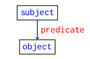
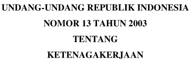
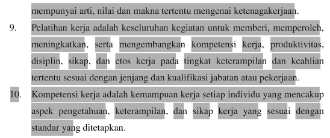
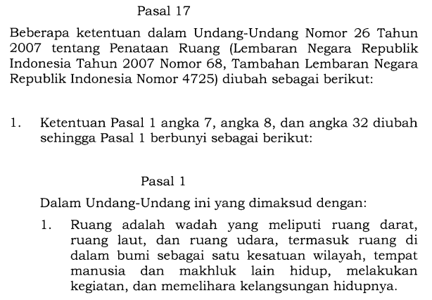

# BAB 1 PENDAHULUAN

## Latar Belakang

Peraturan   perundang-undangan   adalah   peraturan tertulis  yang  memuat norma
hukum  yang  mengikat secara  umum  dan  dibentuk  atau  ditetapkan  oleh
lembaga negara atau pejabat yang berwenang melalui prosedur yang ditetapkan
dalam peraturan perundang-undangan, sesuai yang dijelaskan dalam UU Nomor 12
Tahun 2011 Pasal 1 Ayat 2 [1]. Peraturan perundang-undangan dapat digunakan
untuk menjawab pertanyaan yang berkaitan dengan hukum, seperti:

- Peraturan apa saja yang berlaku pada suatu daerah?
- Apa hubungan suatu peraturan dengan peraturan lain?
- Apa saja peraturan yang mengatur suatu topik?

Pertanyaan-pertanyaan tersebut umumnya dapat dijawab oleh seorang ahli hukum,
artinya penerapan peraturan perundang-undangan ini hanya dapat dilakukan dalam
skala kecil dan biaya relatif mahal. Komputer dapat menjadi alternatif untuk
aplikasi tersebut dalam skala lebih besar dan biaya lebih murah, jika peraturan
perundang-undangan berupa data terstruktur yang dapat diolah oleh
komputer. Sayangnya, data peraturan perundang-undangan umumnya dibuat dalam
bentuk data semi-terstruktur, yaitu berupa dokumen yang memiliki data
terstruktur seperti aturan penomoran dan aturan struktur (seperti bab, pasal,
dan ayat), tetapi penulisan peraturan sendiri dalam bentuk data tidak
terstruktur yaitu teks bahasa manusia.


// TODO: ".. tetapi penulisan peraturan sendiri dalam bentuk data tidak
terstruktur yaitu teks bahasa manusia." -> Stlh paragraf ini, kasih gambar
snippet isi dari suatu peraturan perundang-undangan (bs yg UU Cipta Kerja), dan
utk gambar tsb bs dijelaskan gmn manual effort (by humans) utk memprosesnya.


Dengan melakukan ekstraksi data dari data tidak terstruktur pada dokumen,
digabung dengan data yang sudah terstruktur, peraturan perundang-undangan dapat
diubah menjadi dapat diolah oleh komputer. Selain dapat menjawab pertanyaan,
representasi _knowledge graph_ juga dapat digunakan untuk analisis karena data
sudah terstruktur. Representasi _knowledge graph_ juga memungkinkan untuk dapat
melakukan _reasoning_. Pada skripsi ini, akan dilakukan konversi dokumen
peraturan perundang-undangan menjadi data terstruktur dalam bentuk _knowledge
graph_, dan memberikan contoh pengaplikasian dari _knowledge graph_ peraturan
perundang-undangan tersebut.

// TODO: Ini bagus bgt kalau bs ada ilustrasinya/diagramnya. Jd gmn bener2 dari
bottom up (dokumen legal dlm format PDF), terus diubah ke KG (dengan support
legal ontology), serta aplikasi-aplikasi apa yg bs dibuat on top of the
constructed KG.

Beberapa usaha telah dilakukan untuk membuat _vocabulary_ untuk _knowledge
graph_ peraturan perundang-undangan seperti _European Legislation Identifier_
(ELI) [2]. Tetapi ELI belum memiliki _vocabulary_ untuk struktur dokumen.
Sehingga dengan membuat _vocabulary_ yang belum tersedia, diharapkan dapat
menjadi kontribusi dalam mendukung pembuatan _knowledge graph_ untuk dokumen
peraturan perundan-undangan.

## Permasalahan

Berikut ini adalah rumusan permasalahan dari penelitian yang dilakukan:

// TODO: - Utk rumusan permasalahan sdh OK, cm yg sblm konversi, ditambahkan,
bgmn membuat legal ontology. Jd ntar konversinya (atau construction) bs jelas
ujung ke ujung, yakni dari PDF ke populasi legal ontology tsb.

- Bagaimana konversi dokumen peraturan perudang-undangan menjadi knowledge graph
  dapat dilakukan secara otomatis?
- Apa saja contoh aplikasi dari knowledge graph peraturan perundang-undangan
  tersebut?

## Batasan Permasalahan

## Sistematika Penulisan

# BAB 2 TINJAUAN PUSTAKA

// TODO: Tinjauan pustaka masih agak minimalis ya :) Dijelasin dong knowledge
graph in general itu apa dan kenapa, RDF (serta Turtle) itu gmn konsepnya,
SPARQL itu gmn, dsb. Jgn pelit2 jg kasih contoh gambar agar lbh mudah dipahami.

// TODO: Yg tinjauan pustaka tentang hukum (peraturan perundang-undangan) jg
agak minimalis. Bs tlg dijelaskan bener2 dari basic kyk, hukum itu apa dan untuk
apa? Apa pentingnya ada hukum? Bgmn jenis-jenis hukum? Bgmn struktur hukum scara
umum? Serta bgmn hukum bs terkait satu sama lain? Yg terpenting, tekankan bhw
hukumnya masih manual bgt utk bikin+cara memanfaatkan produk hukumnya.

// TODO: ELI jg msh simpel. Bs dijelaskan motivasi ELI, serta apa contoh konsep2
yg sdh ada di ELI ontology, serta yg belum ada.


## Knowledge Graph

_Triple_ merupakan tuple dengan yang terdiri dari tiga elemen yaitu subject,
object, dan predikat. Terdapat dua representasi elemen dari _triple_, yaitu URI
dan literal. Resource merupakan URI yang dapat digunakan sebagai subject dan
object. Property merupakan URI yang dapat digunakan sebagai predikat. Literal
hanya dapat digunakan sebagai object. _Knowledge graph_ dibangun dari _triple_.
_resource_ akan dinotasikan dalam `teks monospace berwarna biru` dan _predicate_
akan dinotasikan dalam `teks monospace berwarna merah`.



## Turtle Syntax

TODO: konsep dan sintaks perlu dijelaskan ya di Bab 2

## Peraturan Perundang-undangan

### Jenis Peraturan Perundang-undangan

Terdapat beberapa jenis peraturan perundang-undangan. Setiap dokumen peraturan
perundang-undangan adalah resource, dan memiliki susunan URI yang berbeda.
Menurut UU Nomor 12 Tahun 2011 Pasal 7 Ayat 1 [1], terdapat 7 jenis Peraturan
perundang-undangan yaitu:

- Undang-Undang Dasar Negara Republik Indonesia Tahun 1945;
- Ketetapan Majelis Permusyawaratan Rakyat;
- Undang-Undang/Peraturan Pemerintah Pengganti
- Peraturan Pemerintah;
- Peraturan Presiden;
- Peraturan Daerah Provinsi; dan
- Peraturan Daerah Kabupaten/Kota.

### Amandemen Peraturan Perundang-undangan

## Pemodelan European Legislation Identifier (ELI)

ELI merupakan sistem untuk membuat peraturan perundang-undangan tersedia secara
daring dalam format terstandardisasi, sehingga dapat diakses dan digunakan oleh
berbagai instansi. ELI dibangun berdasarkan persetujuan antara negara-negara EU.
ELI memberikan spesifikasi untuk hal-hal berikut:

- URI untuk informasi peraturan perundang-undangan.
- Metadata yang mendeskripsikan informasi peraturan perundang-undangan. TODO:
  terlalu singkat, ksh konsepnya gmn dan contoh pemodelan ELI utk suatu
  peraturan

// TODO: - ELI kekurangan lainnya ya lbh condong ke pemodelan peraturan di
Eropa, bukan di Indonesia. Misal, gak ada namanya Peraturan Pemerintah, atau
Pergub di ELI :)

# BAB 3 METODOLOGI
// TODO: Utk yg metodologi, sbnrnya standar aja, dimulai dari pertanyaan riset,
lalu pengembangan ontology (URI scheming masuk ke pengembagan ontology),
pengembangan sistem konversi, baru lalu use case evaluation (ini yg legal KG
advanced querying, legal KG chatbot, legal KG visualization) baru large scale
eval (ini yg coba konversi peraturan dlm jumlah besar dan kita sampling utk
evaluasi correctnessnya)

TODO: suatu KG construction dimulai dengan competency questions (requirements).
Saran sy: coba baca serta rangkum (di Bab 2) dan terapkan ini:
www.ksl.stanford.edu/people/dlm/papers/ontology-tutorial-noy-mcguinness-abstract.html
???

## Komponen Dokumen Peraturan Perundang-undangan

Dokumen terdiri dari komponen dokumen. Komponen dokumen diantaranya adalah
`bab`, `bagian`, `paragraf`, `pasal`, `ayat`, dan `point`. Setiap komponen
dokumen merupakan resource, dan memiliki URI. URI sebuah komponen didahului oleh
URI dokumennya. Berikut adalah relasi antara komponen dokumen yang disediakan.

TODO: Relationship antara component 

TODO: URI Schema, contoh input text & output URI

## Amendemen

## Konversi Dokumen Peraturan Perundang-undangan ke Knowledge Graph

Konversi dokumen peraturan perundang-undangan dalam bentuk berkas pdf, menjadi
knowledge graph dalam bentuk berkas turtle, akan melalui struktur data penengah
yaitu JSON. JSON digunakan sebagai pengengah karena kompatibel dengan bahasa
pemrograman typescript, sehingga menuliskan data ke dalam json, atau membaca
berkas json ke dalam program tidak memerlukan suatu serialization atau parsing
khusus.

### Konversi PDF menjadi

# BAB 4 IMPLEMENTASI


## OCR Ulang Berkas PDF

Dokumen peraturan perundang-undangan yang digunakan pada penelitian didapatkan
dalam format berkas PDF. Penulis pada awalnya mencoba langsung mengekstraksi
data dari PDF, tetapi penulis menemukan kesulitan. Salahsatu kesulitan yang
penulis temui adalah terdapatnya salah pemindaian pada berkas PDF. Sebagai
contoh, terdapat teks yang tertulis `Pasal` tetapi mengandung data `Pasai`.
Selain itu, penulis juga menemukan bahwa setiap dokumen mengandung keslahan
pemindaian yang bervariasi. Untuk suatu kasus, teks `(2)` selalu terdeteksi
sebagai `(21` pada suatu dokumen, tetapi tidak pada dokumen lainnya. Pada kasus
lainnya terdapat dokumen yang hampir tidak memiliki kesalahan pemindaian dan
juga terdapat dokumen yang teksnya tidak dapat dibaca samasekali.

Walaupun dokumen-dokumen tersebut dipelihara oleh satu lembaga pada satu situs
web, yaitu oleh Dewan Perwakilan Rakyat pada situs web dpr.go.id/jdih,
masing-masing dokumen dibuat kedalam berkas PDF dengan cara yang berbeda-beda.
Penulis tidak dapat mengetahui secara pasti metode apa yang digunakan, tetapi
dari metadata yang didapatkan dari berkas PDF, penulis dapat membuat beberapa
dugaan. Pada berkas PDF, terdapat metadata dengan nama __Creator__, dimana pada
dokumen-dokumen peraturan Perudang-udangan yang didapatkan, tercantum nama-nama
alat pencetak atau merk dari pencetak tersebut. Dari informasi tersebut penulis
menduga bahwa terdapat sebagian peraturan perundang-undangan yang dibuat menjadi
PDF dengan mencetaknya menjadi kertas terlebih dahulu kemudian di pindai oleh
pemindai dan sebagian lainnya dikonversi langsung dari berkas _.docx_. Data yang
dipindai adalah berupa gambar, artinya teks yang terdapat pada berkas PDF adalah
hasil OCR (_optical character recognition_) oleh pemindai tersebut. Berikut
adalah salahsatu contoh dokumen beserta data yang tercantum sebagai __Creator__
dan contoh kesalahan pemindaiannya yang banyak terjadi.

| Dokumen                | __Creator__            | Kesalahan pemindaian        |
| ---------------------- | ---------------------- | --------------------------- |
| UU Nomor 13 Tahun 2003 | ScanSoft PDF Create! 4 | - (tidak ada)               |
| UU Nomor 6 Tahun 2018  | Canon                  | `(2)` selalu dipindai `(21` |
| PP Nomor 34 Tahun 2021 | Fuji Xerox B9100       | data teks tidak terbaca     |

Pemindaian berkas PDF dengan metode yang berbeda-beda memberikan kualitas hasil
pemindaian yang berbeda-beda dan kesalahan pemindaian yang tidak konsisten.
Untuk menyelesaikan masalah ini, penulis melakukan OCR ulang terhadap semua
dokumen yang akan di konversi. Dengan melakukan OCR ulang menggunakan satu
metode yang sama, penulis tidak hanya berhasil mendapatkan data hasil pemindaian
berkas PDF dengan kualitas pemindaian yang konsisten untuk semua dokumen.
Penulis memilih menggunakan Tesseract OCR [4] sebagai metode OCR karena sifatnya
_open source_ dan mendukung Bahasa Indonesia sebagai bahasa yang dipindai.

## Ekstraksi Berkas PDF menjadi Data _Span_

### Data _Span_

Agar dapat diproses oleh program, berkas PDF perlu diolah menjadi data berupa
daftar teks dan posisinya yang selanjutnya akan disebut _span_. Sebuah _span_
mengandung satu baris teks. Berikut adalah data yang dimiliki oleh sebuah
_span_:

- `str`: teks yand dikandung
- `xL`: koordinat titik terkiri dari _span_
- `xR`: koordinat titik terkanan dari _span_
- `y`: koordinat titik teratas dari _span_
- `pageNum`: nomor halaman
- `id`: _identifier_ unik untuk setiap span

Berikut adalah contoh gambaran berkas PDF dan hasil ekstraksinya menjadi daftar
_span_.



akan dipindai menjadi

```yaml
- xL: 197.52
  xR: 442.79990000000004
  'y': 234.48000000000002
  str: UNDANG-UNDANG REPUBLIK INDONESIA
  pageNum: 1
  id: 0
- xL: 252.72
  xR: 387.6002
  'y': 255.12
  str: NOMOR 13 TAHUN 2003
  pageNum: 1
  id: 1
- xL: 291.12
  xR: 349.68048
  'y': 275.76
  str: TENTANG
  pageNum: 1
  id: 2
- xL: 257.28
  xR: 383.28015999999997
  'y': 296.4
  str: KETENAGAKERJAAN
  pageNum: 1
  id: 3
```

### Membersihkan _Noise_ dari Halaman

Tidak jarang dokumen peraturan Perudang-undangan mengandung data _noise_ yang
tidak ingin kita ekstraksi seperti _header_ dan _footer_. Pada penelitian ini,
penulis menggunakan dokumen dari sumber yang sama sehingga memiliki format yang
sama, dan juga posisi _header_ dan _footer_ yang hampir sama pada setiap
dokumen.


Gambar diatas adalah contoh _header_ yang terdapat pada setiap halaman. Dapat
dilihat bahwa _header_ selalu terdiri dari teks "PRESIDEN REPUBLIK INDONESIA"
dan diikuti oleh nomor halaman, dan selalu terletak di posisi yang hampir sama.
Oleh karena itu, penulis memeriksa teks menggunakan _regex_ dan posisi dari
setiap _span_, kemudian menghapus _span_ tersebut jika terdeteksi sebagai
header.

### Penggabungan Data Berkas PDF Asli dan Hasil OCR Ulang

Pada proses ekstraksi berkas PDF menjadi daftar _span_, penulis menemukan satu
masalah yaitu data hasil OCR tidak konsisten dalam memindai angka. Seperti yang
dapat dilihat pada gambar dibawah, angka 10 berhasil dipindai tetapi angka 9
tidak berhasil. Untuk kasus dibawah, angka hanya tidak terpindai pada hasil OCR
ulang, tetapi terpindai dengan benar pada berkas PDF aslinya. Untuk
menyelesaikan masalah tersebut, penulis melakukan ekstraksi data pada berkas PDF
aslinya, kemudian menggabungkannya dengan data hasil pemindaian untuk melengkapi
bagian yang tidak terpindai.

)

Penulis hanya menggabungkan data dua berkas PDF untuk kasus angka seperti yang
disebutkan diatas. Hal tersebut dikarenakan pada umumnya kita dapat mentolerir
kesalahan pemindaian pada teks, tetapi karena kegagalan pemindaian pada angka
tersebut akan mempengaruhi struktur dokumen, penulis memutuskan solusi diatas.
Sebagai contoh, jika nomor 8 berhasil dipindai dan nomor 9 tidak berhasil, maka
struktur akhir yang dihasilkan akan mengandung semua isi nomor 9 didalam nomor
8, yang mana seharusnya adalah nomor yang terpisah. Berikut berturut-turut
adalah contoh data yang dihasilkan jika nomor 9 tidak berhasil terpindai dan
jika berhasil terpindai.

Jika nomor 9 tidak berhasil terpindai:

```yaml
- type: point
  key: 8
  text: >-
    Informasi ketenagakerjaan adalah gabungan, rangkaian, dan analisis data yang
    berbentuk angka yang telah diolah, naskah dan dokumen yang mempunyai arti,
    nilai dan makna tertentu mengenai ketenagakerjaan.
    9. Pelatihan kerja adalah keseluruhan kegiatan untuk memberi, memperoleh,
    meningkatkan, serta mengembangkan kompetensi kerja, produktivitas, disiplin,
    sikap, dan etos kerja pada tingkat keterampilan dan keahlian tertentu sesuai
    dengan jenjang dan kualifikasi jabatan atau pekerjaan.
```

Jika nomor 9 berhasil terpindai:

```yaml
- type: point
  key: 8
  text: >-
    Informasi ketenagakerjaan adalah gabungan, rangkaian, dan analisis data yang
    berbentuk angka yang telah diolah, naskah dan dokumen yang mempunyai arti,
    nilai dan makna tertentu mengenai ketenagakerjaan.
- type: point
  key: 9
  text: >-
    Pelatihan kerja adalah keseluruhan kegiatan untuk memberi, memperoleh,
    meningkatkan, serta mengembangkan kompetensi kerja, produktivitas, disiplin,
    sikap, dan etos kerja pada tingkat keterampilan dan keahlian tertentu sesuai
    dengan jenjang dan kualifikasi jabatan atau pekerjaan.
```

## Pengelompokan _span_ menjadi Komponen

Teks yang membentuk suatu komponen terdiri dari satu atau lebih _span_, sehingga
daftar _span_ yang didapatkan dari hasil ekstraksi berkas PDF harus
dikelompokkan sehingga setiap kelompok merepresentasikan _span_ yang terdapat
pada suatu komponen. Pengelompokan dilakukan dengan mendeteksi _span_ awal dan
_span_ akhir dari sebuah komponen. Karena daftar _span_ hasil ekstraksi bersifat
1 dimensi, hal ini bisa dilakukan dengan melakukan iterasi pada setiap _span_,
kemudian menandai awal atau akhir dari sebuah kelompok apabila memenuhi suatu
pola. Setelah ditandai, _span_ akan dikelompokkan sebagai daftar _span_ dari
suatu komponen.

Pengelompokan tidak langsund dilakukan dari daftar _list_ menjadi daftar
komponen, melainkan dibuat pengelompokan _section_ untuk pembagian dokumen
secara garis besar, kemudian baru dikelompokkan sebagai komponen dari
masing-masing _section_ tersebut. Pada gambar dibawah _section_ ditandai dengan
warna biru dan komponen ditandai dengan warna merah. Dapat dilihat bahwa daftar
_span_ data awal dikelompokkan menjadi beberapa _section_ yaitu `judul`,
`metadata`, `babset`, dan `disahkan`. Kemudian _span_ pada section `babset`
dikelompokkan menjadi komponen bab yaitu `Bab 1`, `Bab 2`, dan `Bab 3`. Kemudian
_span_ pada setiap komponen bab dikelompokkan menjadi komponen pasal.
Pengelompokan bertingkat ini dilakukan agar fungsi untuk mendeteksi batas antara
komponen tidak menjadi rumit.


Deteksi batas antara komponen atau _section_ dilakukan dengan melihat data pada
_span_ seperti `str`, `xL`, `xR`, dan `y`. Pada gambar diatas, pola yang
terdeteksi sebagai batas ditandai dengan huruf merah. Sebagai contoh, pada
ekstraki paling kiri, dari daftar _span_ asli menjadi _section_, dilakukan
iterasi _span_ dari atas dan akan dimasukkan ke dalam _section_ `judul` sampai
menemukan _section_ yang diawali dengan kata __Menimbang__. Kemudian setiap
_span_ setelah span __Menimbang__ tersebut akan dikelompokkan menjadi _section_
`metadata` sampai menemukan section yang diawali kata __BAB I__.

### Pengelompokan _span_ pada Komponen Terurut

Beberapa komponen seperti `bab`, `bagian`, `paragraf`, `pasal`, `angka`, dan
`huruf` memiliki sifat terurut. Dalam hal ini, yang termasuk terurut adalah:

- Komponen yang mengawali suatu komponen terurut akan selalu sama.
- Hanya terdapat satu komponen yang dapat mengikuti komponen terurut.

Contoh dari sifat pertama adalah `bab`, `bagian`, `paragraf`, `pasal`, `angka`
pasti dimulai dari komponen nomor 1 seperti `bab 1` dan `pasal 1`, dan `huruf`
pasti dimulai dari komponen `huruf a`. Contoh dari sifat kedua adalah hanya
`pasal 2` yang dapat mengikuti `pasal 1` dan hanya `huruf b` yang dapat
mengikuti `huruf a`. Dalam implementasi, penulis memastikan sifat-sifat ini
dipatuhi, sehingga sebagai contoh apabila sebuah dokumen terdeteksi mengandung
`bab 12` maka akan dijamin mengandung semua `bab 1` sampai `bab 11` dan apabila
terdeteksi mengandung `pasal 196` maka akan dijamin mengandung semua pasal dari
`pasal 1` sampai `pasal 195`.

### Komponen Amandemen

Mengekstraksi _span_ pada bagian amandemen merupakan salahsatu tantangan pada
penelitian ini. Dibawah adalah gambar amandemen pada Pasal 17 UU Nomor 11 Tahun
2020 yang dilakukan terhadap Pasal 1 UU Nomor 26 Tahun 2007. Dapat dilihat bahwa
kata `Pasal 17` dan `Pasal 1` yang digunakan sebagai pembatas antara komponen
memiliki pola teks dan posisi yang hampir sama. Hal ini membuat pembedaan antara
"Pasal biasa" dan "Pasal peng-amandemen" menjadi sulit dilakukan.



Untuk menyelesaikan masalah ini, penulis menggunakan koordinat `xL` _span_ tepat
setelah _span_ yang bertuliskan "Pasal X". Pada contoh deteksi kompoonen
amandemen di bawah, `xL` dari teks setelah pasal peng-amandemen (pasal biasa)
ditandai dengan lingkaran merah, `xL` dari pasal yang diamandemen ditandai
dengan lingkaran biru, dan garis hijau merepresentasikan batas pemeda `xL`
antara pasal biasa dan pasal yang diamandemen. Pembedaan pasal biasa dan pasal
amandemen hanya dilakukan jika dokumen memiliki komponen berupa amandemen.


## Deteksi Sitasi

Setelah semua _span_ dikelompokan menjadi suatu komponen, dilakukan deteksi
sitasi pada teks pada setiap komponen untuk mengetahui apakah komponen tersebut
menyebut komponen atau dokumen peraturan perundang-undangan lainnya. Berikut
adalah daftar pola sitasi yang berhasil dideteksi pada penelitian ini.

| Pola                                                     | Contoh teks                                              | URI Terdeteksi                        |
| -------------------------------------------------------- | -------------------------------------------------------- | ------------------------------------- |
| Undang Undang Dasar Negara Republik Indonesia Tahun 1945 | Undang Undang Dasar Negara Republik Indonesia Tahun 1945 | /uud/                                 |
| Undang-Undang Nomor {x} Tahun {y}                        | Undang-Undang Nomor 26 Tahun 2007                        | /uu/2007/26                           |
| ayat ({x})                                               | ayat (1)                                                 | /uu/2003/13/pasal/169/ayat/1          |
| Pasal {x}                                                | Pasal 156                                                | /uu/2003/13/pasal/156                 |
| Pasal {x} ayat ({y})                                     | Pasal 156 ayat (2)                                       | /uu/2003/13/pasal/156/ayat/2          |
| huruf {x}, {y}, ... dan {z}                              | huruf a, b, c, d, dan e                                  | /uu/2003/13/documentMenimbang/point/a |
|                                                          |                                                          | /uu/2003/13/documentMenimbang/point/b |
|                                                          |                                                          | /uu/2003/13/documentMenimbang/point/c |
|                                                          |                                                          | /uu/2003/13/documentMenimbang/point/d |
|                                                          |                                                          | /uu/2003/13/documentMenimbang/point/e |
| huruf {x} dan {y}                                        | huruf a dan b                                            | /uu/2003/13/pasal/1/point/5/point/a   |
|                                                          |                                                          | /uu/2003/13/pasal/1/point/5/point/b   |

Data sitasi mengandung data sebagai berikut:

- `start`: _index_ karakter awal sitasi
- `end`: _index_ karakter akhir sitasi
- `uri`: URI dokumen dan

Berikut adalah contoh teks pada Undang-Undang Nomor 13 Tahun 2003 Pasal 158 Ayat
(4) beserta sitasi yang terdeteksi.

```yaml
textString: >-
  Pekerja/buruh yang diputus hubungan kerjanya berdasarkan alasan sebagaimana
  dimaksud dalam ayat (1), dapat memperoleh uang penggantian hak sebagaimana
  dimaksud dalam Pasal 156 ayat (4).
references:
  - start: 91
    end: 99
    uri: /uu/2003/13/pasal/158/ayat/1
  - start: 166
    end: 184
    uri: /uu/2003/13/pasal/156/ayat/4
```

Untuk melakukan deteksi, teks akan melalui fungsi yang masing-masing memiliki
pola untuk dideteksi. Oleh karena itu, untuk _substring_ yang beririsan dapat
memiliki lebih dari dua sitasi yang terdeteksi. Pada kasus tersebut akan diambil
sitasi dengan _substring_ terpanjang. Sebagai contoh, teks "Pasal 156 Ayat (4)"
pada UU No.13 Tahun 2003 Pasal 158 Ayat (4) akan terdeteksi sebagai 3 URI sitasi
sebagai berikut.

| Teks               | URI                            |
| ------------------ | ------------------------------ |
| Pasal 156 Ayat (4) | `/uu/2003/13/pasal/156/ayat/4` |
| Pasal 156          | `/uu/2003/13/pasal/156`        |
| Ayat (4)           | `/uu/2003/13/pasal/158/ayat/4` |

Pada kasus ini, yang akan diambil adalah teks "Pasal 156 ayat (4)" karena
merupakan teks terpanjang.

## Data To MD

visualization

## Data to triple

### triple definition

### triple to ttl

part of

??? Bab3 atau Bab 4?

# BAB 5 EVALUASI DAN ANALISIS HASIL

## Maintained docs masukin mana?

## Aplikasi Knowledge Graph Peraturan Perundang-undangan

Dibuat _chatbot_ untuk mensimulasikan pengaplikasian KG. _Chatbot_ akan
memproses input yand diberikan oleh user, kemudian meng-_generate_ SPARQL
_query_. Chatbot akan menampilkan hasil dari _query_ tersebut.

## Evaluasi Hasil Konversi

Evaluasi akan dilakukan terhadap semua dokumen yang terdapat pada
peraturan.go.id. Selanjutnya dokumen-dokumen ini akan disebut dokument tes.

## Evaluasi Manual

Evaluasi kualitatif dilakukan terhadap sebagian dokumen yang didapatkan dari
hasil sam- pling dari dokumen tes. Seorang penilai akan melihat markdown dari
setiap dokumen hasil sampling, masing-masing dokumen akan diberikan skor 0
sampai 100. Kualitas konversi dapat dilihat dari rata-rata skor tersebut.

## Evaluasi Otomatis

Evaluasi dilakukan dengan terlebih dahulu mendefinisikan metadata yang pasti
terdapat pada sebuah dokumen (misal, tempat dokumen disahkan), kemudian
menghitung sebera pa banyak metadata yang berhasil diekstrak. Metadata hasil
ekstraksi yang akan dihitung tidak perlu sesuai dengan yang terdapat di dalam
dokumen.

[1]: luk.staff.ugm.ac.id/atur/UU12-2011Lengkap.pdf
[2]: https://eur-lex.europa.eu/eli-register/about.html
[3]: www.ksl.stanford.edu/people/dlm/papers/ontology101/ontology101-noy-mcguinness.html
[4]: https://github.com/tesseract-ocr/tesseract
